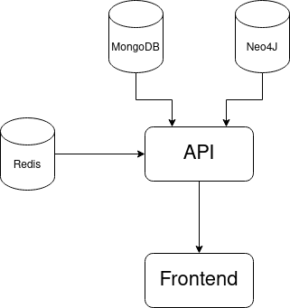

# Spring 2023 exam project overview

## Overview
This project is a route planning app for the New York City public transit network, with a function to view points of interest near the stops. 
It features a Neo4J graph database for route planning queries, a MongoDB for keeping points of interest and doing geospatial queries for them, and redis for caching API request data. 

## Use cases
For this project we only have a single type of user in mind, which is people who are unfamiliar with NYC an it's public transit network. 

### primary use case
find best route between two points, while informing user about the area.

**primary actor**: Unfamiliar user (tourist/new resident)

**goal**: Find their way around the city easily, while organically discovering places.

**preconditions**: 
- The user has the route planning site open on a device.
- The device has internet
- The user has a starting location and a destination to input

**Main success scenario** 
- The user opens the site, and inputs their starting location and destination
- The user clicks the "find route" button
- The app displays one or more routes that will take the user to their destination
- The user clicks on one of the stops on the map
- The app displays a number of points of interest around the station 

## requirements
### functional
- The system should be able to provide a viable route between any two stops that can be connected by the network.
- The system should provide points of interest for the user to experience around their destination.

### non-functional
- The system must remain responsive under load, such that users will not miss connections due to unresponsiveness, etc...

## Technologies

**Neo4J** 
Neo4j was chosen because it's graph structure lends itself well to the kinds of routing queries we want to do. Instead of doing a bunch of lookups in a bunch of different SQL tables, for example, we can simply use a pathfinding algorithm to traverse the nodes in our graph, using the relations between them. For this kind of system, where data is highly connected, and rarely updated, Neo4J is ideal. 

**MongoDB** 
We chose MongoDB because we needed a mass data store with geospatial features, but didn't necessarily need the stricter safety features of a relational database. MongoDB is also easier to scale horizontally, should we need that in future.

**Redis** 
We use Redis to cache query results from our databases. By fetching response-ready data from cache for identical queries, we avoid having to query the database an extra time, and then transform the result to something we can send as a response.

## Architecture

For the architecture we chose a simple three layer monolithic architecture, with a frontend layer, an API that serves data to the frontend, and a database layer consisting of our three databases. 
For an application of larger scope, it might have been wiser to choose a service based architecture, and split up, for example, the route planning API logic, and the logic for finding points of interest. 
But since the scope of our application is fairly limited, the monolithic approach saved us a lot of time that would have been spent integrating services and making sure they deploy correctly.
